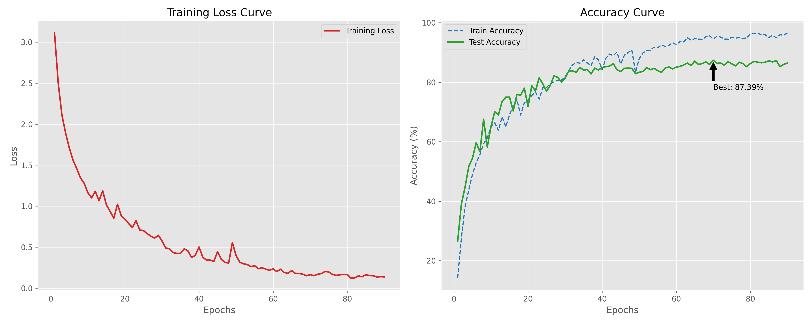

# 深度学习课设

## 项目简介

题目：基于动态图卷积神经网络（DGCNN）的3D高斯泼溅物品分类研究

目录结构：
- [模型定义](./model.py)
- [训练脚本](./train.py)
- [数据处理脚本](./process_package_data.py)
- [结果可视化脚本](./plot_results.py)
- [训练日志](./train.log)
- [训练结果](./checkpoints/training_log.json)

## 最终结果

| Model    | Accuracy |
|----------|----------|
| DGCNN    | 87.39%   |
| PointNet | 64.91%   |

